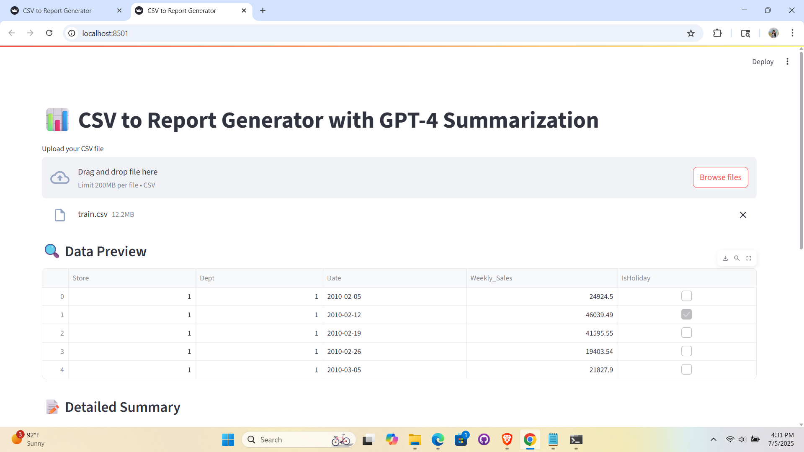
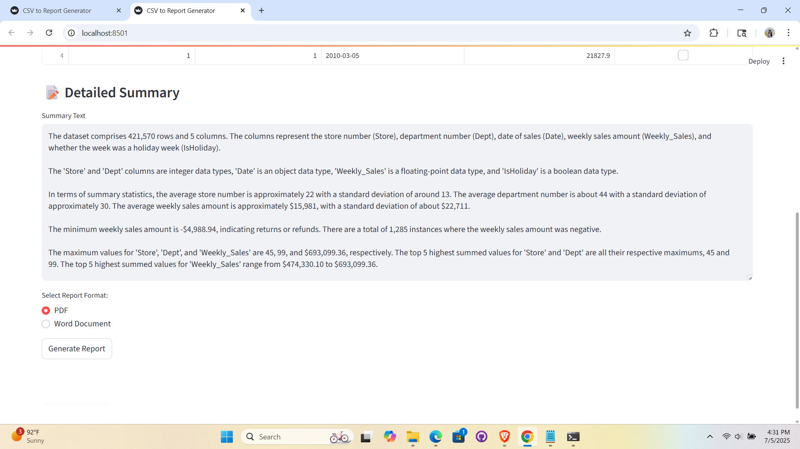

# Automated Data Insights with LLMs

This project is an **end-to-end data analysis and reporting tool** that:
- Analyzes your CSV datasets
- Generates descriptive plots
- Summarizes the dataset using **OpenAI Large Language Models (LLMs)**
- Creates downloadable PDF and Word reports
- Provides an interactive **Streamlit UI**

---

## Project Workflow

Below is a high-level workflow diagram of how the project operates:

```
CSV File
     |
     v
[Streamlit UI]
     |
     v
[Data Validation & Cleaning]
     |
     v
[Plot Generation (Seaborn/Matplotlib)]
     |
     v
[Summary Creation (OpenAI LLM)]
     |
     v
[PDF Report + Word Export]
```


---

## Features
 Automatic dataset profiling  
 Intelligent summarization using OpenAI models  
 Clean, informative visualizations  
 Option to export reports in PDF or Word format  
 Streamlit-based user interface

---

## User Interface Screenshots

**Upload CSV and Generate Report**



**Generated Summary and Download Options**



---

## Step-by-Step Setup Instructions

Follow these steps carefully to set up and run the project on your machine:

---

### 1️) Clone the Repository

```bash
git clone https://github.com/yourusername/automated-data-insights-llms.git
cd automated-data-insights-llms
```

*(Adjust the repo URL if needed)*

---

### 2️) Create and Activate a Python Virtual Environment

**Windows:**
```bash
python -m venv venv
venv\Scripts\activate
```

**macOS/Linux:**
```bash
python3 -m venv venv
source venv/bin/activate
```

---

### 3️) Install Project Dependencies

```bash
pip install -r requirements.txt
```

**Or install manually:**
```bash
pip install streamlit pandas matplotlib seaborn fpdf openai python-docx
```

---

### 4️) Create an OpenAI Account and API Key

1. Go to [https://platform.openai.com/](https://platform.openai.com/).
2. Log in or create an account.
3. In your dashboard, click **API Keys**.
4. Click **+ Create new secret key**.
5. Copy the key.

 **Important:** Store this key safely. You will use it to authenticate with OpenAI.

---

### 5️) Configure the API Key in `app.py`

In `app.py`, find this code:

```python
client = OpenAI(api_key="sk-...")
```

Replace `sk-...` with your actual OpenAI key:

```python
client = OpenAI(api_key="sk-YourSecretKeyHere")
```

---

### 6️) Using the OpenAI Model for Summarization

By default, this project uses `gpt-4`.  
You can change to `gpt-3.5-turbo` if you prefer:

```python
response = client.chat.completions.create(
    model="gpt-4",
    messages=[
        {"role": "system", "content": "You are a data analysis expert. Summarize this dataset in a clear and insightful way."},
        {"role": "user", "content": text}
    ]
)
```

---

### 7️) Running the Streamlit App Locally

Launch the app with:

```bash
streamlit run app.py
```

This will:
- Open a browser window at `http://localhost:8501`
- Let you upload a CSV
- Display the data preview
- Generate visualizations
- Summarize your data
- Export reports in PDF and Word formats

---

---

## Example Use Cases

- Automated EDA for analysts
- Quick profiling for business teams
- Summarization of large datasets for stakeholders

---

## Author

Isha Narkhede  
[LinkedIn](https://www.linkedin.com/in/isha-narkhede/) • [GitHub](https://github.com/Isha2605)

---
